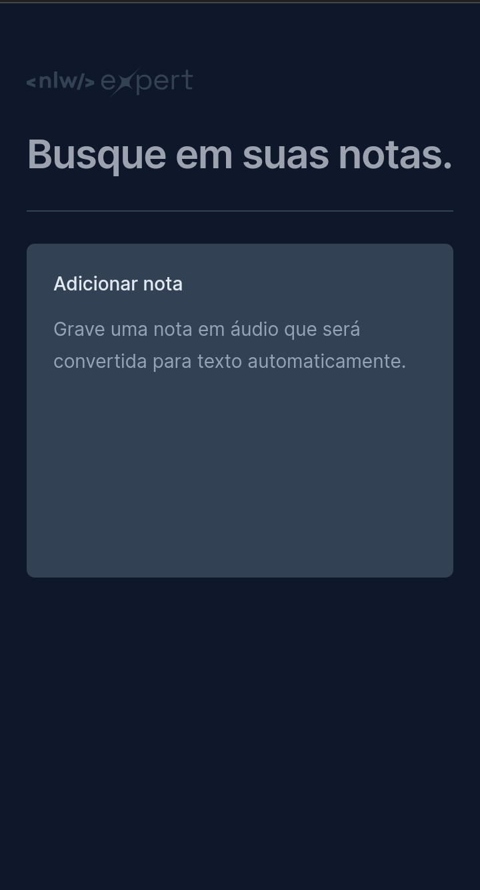
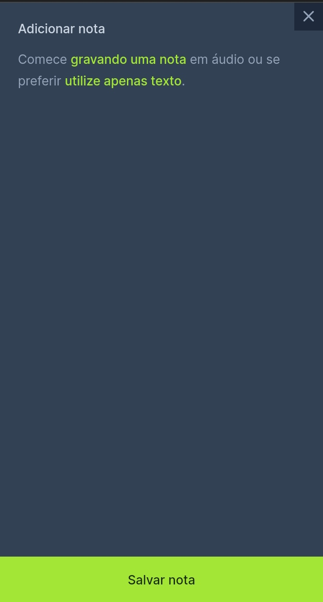
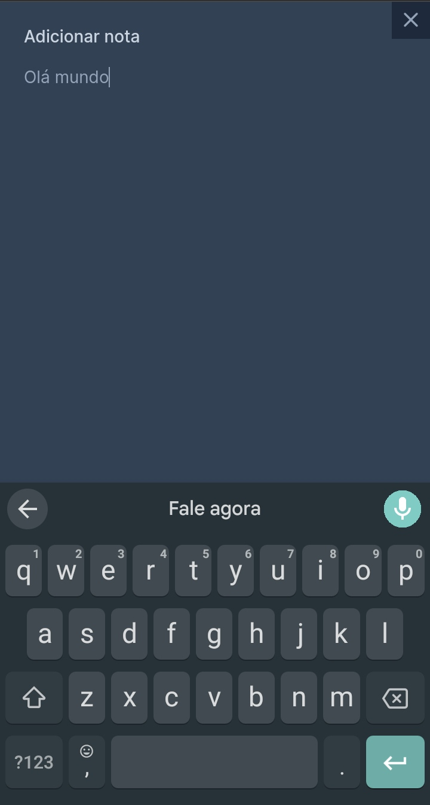
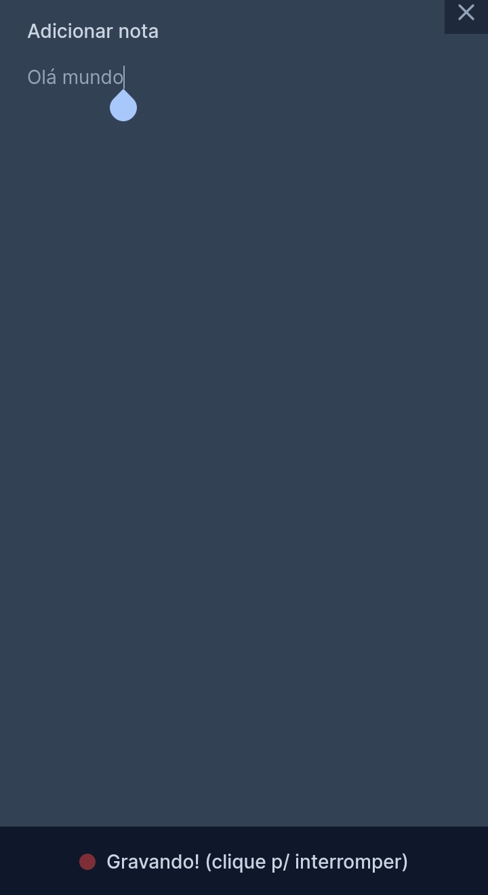
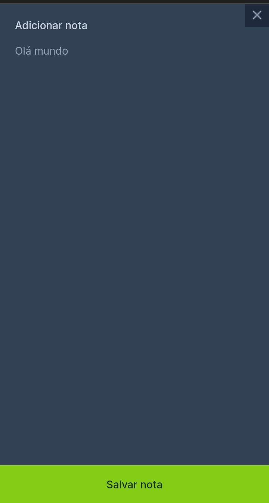
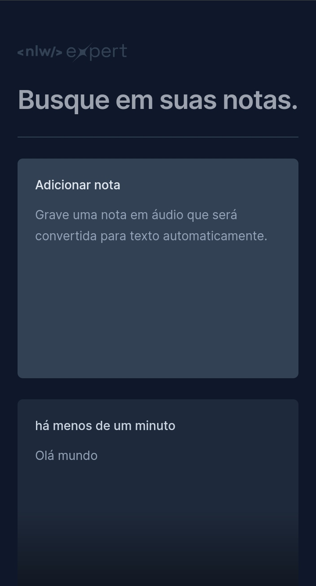
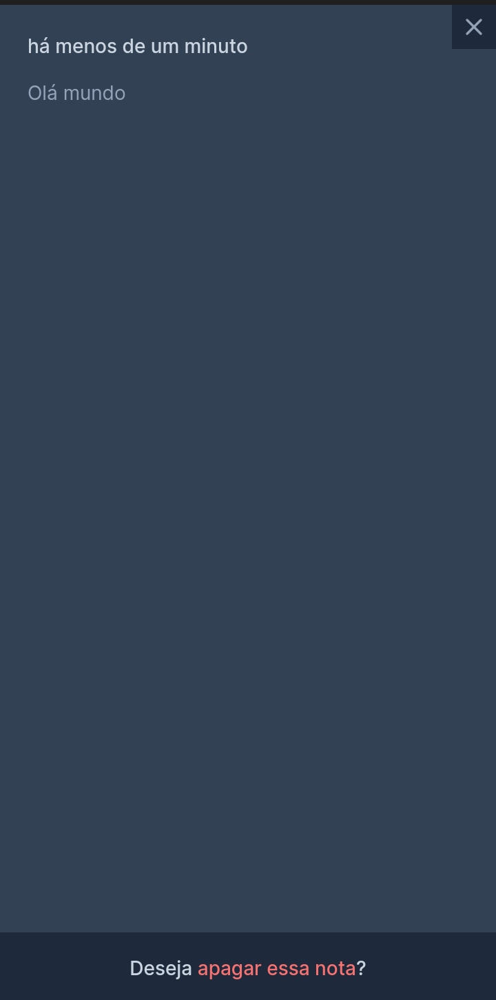
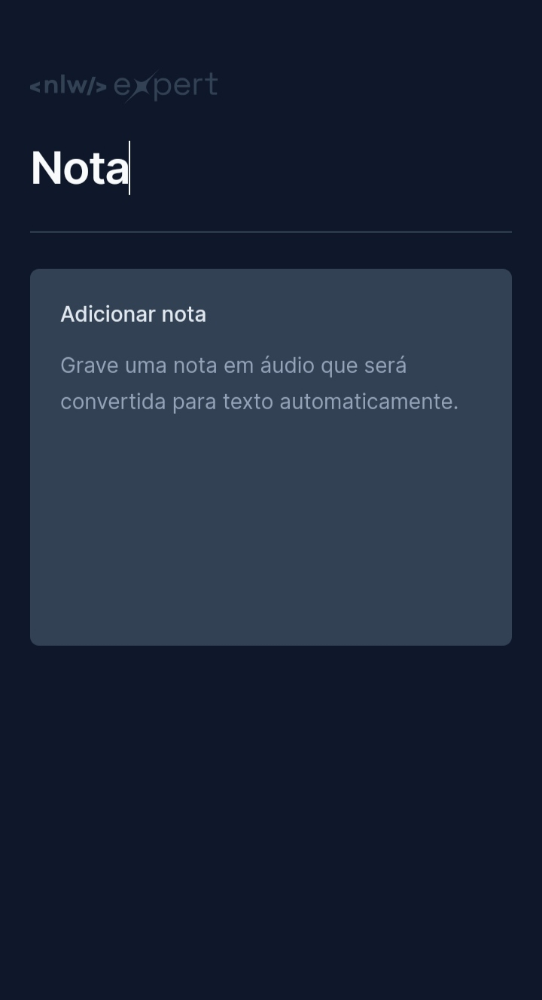

<h2 align="center">Notes expert</h2>

Desenvolvido durante a semana 05/02-07/02 de 2024 no NLW Expert, promovido pela Rocketseat 🚀. Apesar de não ser considerado um projeto de portifólio (Porque não foi eu quem idealizou e arquitetou o projeto) porém acompanhei e codei juntamente durante as aulas, e isso me fez perceber que ainda preciso aprender muita coisa de React e Typescript. E com um "simples" projeto você pode aprender skills avançadas. 

- [Overview](#overview)
  - [Sobre o projeto](#sobre)
  - [Screenshots](#screenshots)
  - [Links](#links)
- [My process](#my-process)
  - [Desenvolvido com](#tecnologias)
  - [Recursos úteis](#recursos-úteis)
- [Author](#autor)

 

## Overview
### Sobre
#### Importância desses tipos de projeto
O bom de projetos como este de Workshops, Bootcamps, cursos e etc... É que você acompanhou o seu desenvolvimento e codou juntamente com o "mestre jedi", então você viu (E pode ter entendido 100%) a criação do projeto. Isso é excelente para ideias futuras, pois você poderá se espelhar (Até mesmo copiar) funcionalidades que você já conhece de projetos guardados que você tem, com isso poderá criar e idealizar projetos próprios para o seu portifólio.
#### Agora sobre o projeto
O Notes expert é um app web de notas onde você poderá criar suas notas por texto ou por áudio

**Requisitos Funcionais:**
1. **Pesquisa de Notas:**
   - O aplicativo deve permitir que o usuário pesquise suas notas através de um input, filtrando por palavras contidas nas notas, sem distinguir entre maiúsculas e minúsculas.

2. **Criação de Notas:**
   - O aplicativo deve fornecer um botão de criação de notas que, ao ser clicado, abre um modal com opções de criação.

3. **Opções de Criação:**
   - O modal de criação de notas deve oferecer duas opções: texto e áudio.

4. **Criação de Nota por Texto:**
   - Se o usuário escolher criar nota por texto, o modal deve apresentar um textarea para digitar a nota.
   - Deve haver um botão para salvar a nota.

5. **Criação de Nota por Áudio:**
   - Se o usuário optar por criar nota por áudio, o aplicativo deve solicitar permissão para gravar áudio.
   - O modal deve exibir um botão com a opção de parar e salvar posteriormente.
   - Se o navegador não suportar a Speech Recognition API, mostrar uma mensagem informando a incompatibilidade.

6. **Exclusão de Texto no Modal:**
   - Se o usuário apagar todo o texto durante a criação da nota, o modal deve retornar ao estado inicial de escolha de opções.

7. **Notificação de Salvamento:**
   - Ao clicar em salvar nota, o aplicativo deve exibir um toast notificando que a nota foi salva.

8. **Visualização Detalhada de Nota:**
   - O usuário deve poder visualizar mais detalhes de uma nota ao clicar sobre ela.
   - Deve haver um modal que exiba o conteúdo completo da nota, incluindo seu cabeçalho com o tempo de criação.

9. **Exclusão de Nota:**
   - No modal de visualização detalhada, deve existir um botão para excluir a nota, se desejado pelo usuário.

**Requisitos Não Funcionais:**
1. **Armazenamento Local:**
   - As notas devem ser armazenadas no localstorage do dispositivo para persistência, garantindo que não se percam ao reiniciar a página.

2. **Compatibilidade de Navegadores:**
   - O aplicativo deve ser compatível com os navegadores suportados pela Speech Recognition API para oferecer a funcionalidade de criação de notas por áudio.

### Screenshots

  

  

  

  

  

  

  

  

### Links
- [Acesse o projeto finalizado, online ☁️](https://notes-expert-ti.vercel.app)

 

## My process
### Tecnologias
### ⚙️👨‍💻
Esse projeto foi desenvolvido com as seguintes tecnologias:

- **Vite:** Tooling frontend usado para iniciar e criar a aplicação;
- **React:** Usado para a componentização e manipulação de estados dos componentes;
- **Typescript:** Linguagem utilizada para desenvolver o projeto;
- **TailwindCSS:** Principal fonte de estilização do projeto;
- **Radix UI:** Utilizado para a criação dos modais;
- **Sonner:** Criação do Toast de notificação;
- **date-fns:** Manipulação de datas/horas;
- **Lucide React:** Para criar o icon de close;
- **Speech Recognition API:** Utilizado para o reconhecimento de voz;
- **Git/Github:** Para o versionamento de código;

<!--
### Continuar o desenvolvimento
Pretendo adicionar um elemento search-box para fazer a pesquisa e filtragem das informações/dados do CRUD.
-->
### Recursos úteis
- [Vite.js](https://vitejs.dev) - Faster frontend tooling.
- [TailwindCSS](https://www.google.com/url?sa=t&source=web&rct=j&opi=89978449&url=https://tailwindcss.com/&ved=2ahUKEwikl8uthJyEAxV0rpUCHSVwBAsQFnoECAYQAQ&usg=AOvVaw2vSN7AVcVeE7IjW449Pt1C) - Tailwind CSS é uma estrutura CSS inovadora para construir sites modernos rapidamente, sem nunca sair do HTML.
- [Radix UI](https://www.google.com/url?sa=t&source=web&rct=j&opi=89978449&url=https://www.radix-ui.com/&ved=2ahUKEwjbwdG2hJyEAxX1pJUCHaAICA0QFnoECAoQAQ&usg=AOvVaw2l93cFwpUlsLiDL97-JvaN) - Componentes, ícones e cores para criar uma interface de usuário acessível e de alta qualidade. Gratuito e de código aberto.
- [Date-fns](https://www.google.com/url?sa=t&source=web&rct=j&opi=89978449&url=https://date-fns.org/&ved=2ahUKEwi0lOm_hZyEAxXupJUCHUSyBf4QFnoECAUQAQ&usg=AOvVaw2P4Hw-7WUJwYkO4NAM2VNr) - Imutável e Puro. date-fns é construído usando funções puras e sempre retorna uma nova instância de data em vez de alterar a passada.
- [SpeechRecognition](https://developer.mozilla.org/en-US/docs/Web/API/SpeechRecognition) - The SpeechRecognition interface of the Web Speech API is the controller interface for the recognition service.
- [Can I use](https://caniuse.com/) - Um site para pesquisar se uma ferramenta é compatível com um navegador.

 

## Autor
*João Alison TI 👨🏽‍💻*

---

<strong>2024</strong>